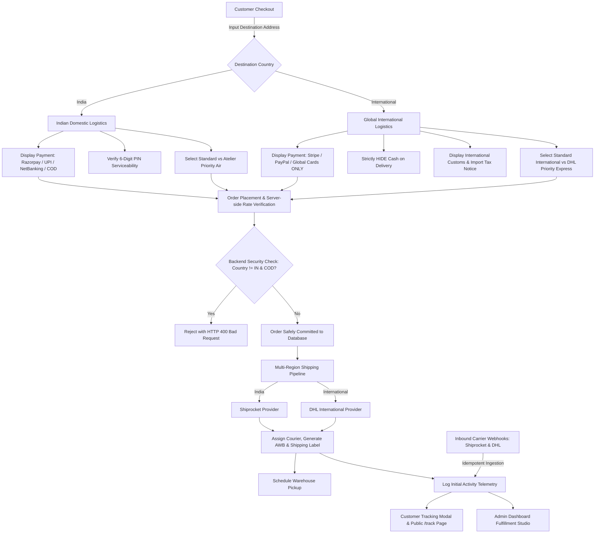

# 🚚 YURAE BEAUTY — Production Shipping & Order Fulfillment Architecture
## Domestic (India / Shiprocket) & International (USA, UK, Canada, Australia, UAE, Singapore / DHL Express)

This document provides a comprehensive operational and technical manual for the **Yurae Beauty** automated multi-region order fulfillment architecture.

---

## 🌟 1. System Architecture & Flow



---

## 📁 1. Files Created & Modified

### Files Created:
1. [`backend/app/database/migrate_shipping_v2.py`](file:///c:/Users/Kiruthika/Documents/yurae/backend/app/database/migrate_shipping_v2.py): Database migration script adding `shipping_service_tier`, `destination_country`, `shipping_cost`, and international customs fields (`customs_declared_value`, `customs_currency`, `customs_hs_code`, `customs_description`) to the `shipments` table.
2. [`frontend/src/pages/TrackingPage.tsx`](file:///c:/Users/Kiruthika/Documents/yurae/frontend/src/pages/TrackingPage.tsx): Dedicated customer-facing public tracking page searching by Order Reference Number or Air Waybill (AWB).
3. [`SHIPPING_SETUP.md`](file:///c:/Users/Kiruthika/Documents/yurae/SHIPPING_SETUP.md): Master technical guide and deployment checklist.

### Files Modified:
1. [`backend/app/core/config.py`](file:///c:/Users/Kiruthika/Documents/yurae/backend/app/core/config.py): Added international shipping settings (`INTERNATIONAL_SHIPPING_PROVIDER`, `DHL_API_KEY`, `DHL_API_SECRET`, `DHL_ACCOUNT_NUMBER`, `DHL_BASE_URL`, `SHIPPING_API_KEY`, `SHIPPING_API_SECRET`, `SHIPPING_WEBHOOK_SECRET`).
2. [`backend/.env.example`](file:///c:/Users/Kiruthika/Documents/yurae/backend/.env.example): Documented all configuration keys for both domestic and international logistics providers.
3. [`backend/app/models/models.py`](file:///c:/Users/Kiruthika/Documents/yurae/backend/app/models/models.py): Updated `Shipment` database entity with international customs declaration attributes and service tier columns.
4. [`backend/app/schemas/schemas.py`](file:///c:/Users/Kiruthika/Documents/yurae/backend/app/schemas/schemas.py): Updated `ServiceabilityRequest`, `ServiceabilityResponse`, `CourierOption`, `ShipmentResponse`, and `ShippingLabelResponse`.
5. [`backend/app/services/shipping_provider.py`](file:///c:/Users/Kiruthika/Documents/yurae/backend/app/services/shipping_provider.py): Built `BaseShippingProvider` abstraction, `ShiprocketProvider` for India, `DHLInternationalProvider` for global shipments, and `get_shipping_provider(country)` dispatch factory.
6. [`backend/app/services/shipping_service.py`](file:///c:/Users/Kiruthika/Documents/yurae/backend/app/services/shipping_service.py): Built multi-region rate engine, strict COD validation, automated fulfillment pipeline, package metrics calculator, and idempotent webhook handler.
7. [`backend/app/api/orders.py`](file:///c:/Users/Kiruthika/Documents/yurae/backend/app/api/orders.py): Added strict backend rejection of international COD orders, multi-region shipping fee calculation, and automated dispatch triggers.
8. [`backend/app/api/shipping.py`](file:///c:/Users/Kiruthika/Documents/yurae/backend/app/api/shipping.py): Implemented endpoints for multi-region serviceability, tracking, shipping label downloads, admin pickups, and universal webhooks.
9. [`backend/app/main.py`](file:///c:/Users/Kiruthika/Documents/yurae/backend/app/main.py): Mounted `/api/webhooks/shipping` and `/api/shipping/webhooks/shiprocket`.
10. [`frontend/src/types/index.ts`](file:///c:/Users/Kiruthika/Documents/yurae/frontend/src/types/index.ts): Added types for `CourierOption`, `ServiceabilityResult`, `TrackingTimelineEvent`, `ShippingSettings`.
11. [`frontend/src/pages/CheckoutPage.tsx`](file:///c:/Users/Kiruthika/Documents/yurae/frontend/src/pages/CheckoutPage.tsx): Implemented 5-step checkout flow, dynamic payment options (hiding COD for non-India), international customs notice, and shipping tier selector.
12. [`frontend/src/pages/AccountPage.tsx`](file:///c:/Users/Kiruthika/Documents/yurae/frontend/src/pages/AccountPage.tsx): Interactive tracking stepper on order cards.
13. [`frontend/src/pages/AdminDashboard.tsx`](file:///c:/Users/Kiruthika/Documents/yurae/frontend/src/pages/AdminDashboard.tsx): Dedicated `🚚 Shipping & Fulfillment` tab with region filters (`All`, `Domestic India 🇮🇳`, `International Global 🌐`), 1-click AWB, label PDFs, pickup scheduling, and live tracking.
14. [`backend/tests/test_shipping.py`](file:///c:/Users/Kiruthika/Documents/yurae/backend/tests/test_shipping.py): 14-scenario automated test suite.

---

## 🗄️ 2. Database Changes

The `shipments` table contains the following columns:
- `shipping_service_tier`: `VARCHAR(50)` (e.g. `STANDARD`, `EXPRESS`)
- `destination_country`: `VARCHAR(100)` (e.g. `India`, `United States`, `Canada`)
- `shipping_cost`: `FLOAT`
- `customs_declared_value`: `FLOAT` (Subtotal declared for export customs)
- `customs_currency`: `VARCHAR(10)` (e.g. `USD`, `EUR`, `GBP`)
- `customs_hs_code`: `VARCHAR(50)` (`3304.99` for Luxury Beauty & Skincare)
- `customs_description`: `VARCHAR(255)` (`Luxury Cosmetics & Skincare Preparations`)

---

## ⚙️ 3. Environment Variables Configuration (`backend/.env`)

```env
# ==============================================================================
# 🚚 MULTI-REGION LOGISTICS CONFIGURATION
# ==============================================================================
SHIPPING_MODE=test # 'test' for simulation sandbox, 'production' for live courier APIs
SHIPPING_PROVIDER=shiprocket
INTERNATIONAL_SHIPPING_PROVIDER=dhl_express

# Generic Webhook Secret
SHIPPING_WEBHOOK_SECRET=yurae_universal_webhook_secret_2026

# India Domestic Carrier (Shiprocket)
SHIPROCKET_EMAIL=your_shiprocket_email@yuraebeauty.com
SHIPROCKET_PASSWORD=your_shiprocket_password
SHIPROCKET_BASE_URL=https://apiv2.shiprocket.in/v1/external
SHIPROCKET_PICKUP_LOCATION=Primary Warehouse
SHIPROCKET_WEBHOOK_TOKEN=yurae_shiprocket_webhook_secret_2026

# Global International Carrier (DHL Express)
DHL_API_KEY=your_dhl_api_key
DHL_API_SECRET=your_dhl_api_secret
DHL_ACCOUNT_NUMBER=your_dhl_account_number
DHL_BASE_URL=https://express.api.dhl.com/mydhlapi/test

# Domestic Rates (INR)
COD_ENABLED=true
DEFAULT_FLAT_SHIPPING_FEE=99.00
DEFAULT_FREE_SHIPPING_THRESHOLD=1500.00
DEFAULT_DOMESTIC_EXPRESS_SURCHARGE=100.00

# International Rates (USD Base)
DEFAULT_INTERNATIONAL_FLAT_FEE_USD=15.00
DEFAULT_INTERNATIONAL_FREE_THRESHOLD_USD=50.00
DEFAULT_INTERNATIONAL_EXPRESS_SURCHARGE_USD=15.00

# Primary Warehouse Origin Address
WAREHOUSE_CONTACT_NAME="YURAE Fulfillment Atelier"
WAREHOUSE_EMAIL="logistics@yuraebeauty.com"
WAREHOUSE_PHONE="+91 98765 43210"
WAREHOUSE_ADDRESS="Plot 42, Luxury Beauty Park, EPIP Zone, Whitefield"
WAREHOUSE_CITY="Bengaluru"
WAREHOUSE_STATE="Karnataka"
WAREHOUSE_PINCODE="560066"
WAREHOUSE_COUNTRY="India"
```

---

## 🔒 4. COD Rules & Payment Logic

| Destination Country | Allowed Payment Methods | COD Allowed? | Backend Behavior |
| :--- | :--- | :--- | :--- |
| **India (`IN`)** | Razorpay (Cards, UPI, NetBanking), COD | ✅ **YES** | Order created; Payment marked `Pending`; AWB generated |
| **United States (`US`)** | Stripe, PayPal, International Cards | ❌ **NO** | COD hidden in UI; API rejects with HTTP `400 Bad Request` |
| **Canada (`CA`)** | Stripe, PayPal, International Cards | ❌ **NO** | COD hidden in UI; API rejects with HTTP `400 Bad Request` |
| **United Kingdom (`GB`)** | Stripe, PayPal, International Cards | ❌ **NO** | COD hidden in UI; API rejects with HTTP `400 Bad Request` |
| **Australia (`AU`)** | Stripe, PayPal, International Cards | ❌ **NO** | COD hidden in UI; API rejects with HTTP `400 Bad Request` |
| **UAE / Singapore / Others** | Stripe, PayPal, International Cards | ❌ **NO** | COD hidden in UI; API rejects with HTTP `400 Bad Request` |

---

## 🌐 5. Webhook URLs

Register these endpoints in your courier dashboards for real-time tracking updates:

- **Shiprocket Webhook URL**: `https://api.yuraebeauty.com/api/shipping/webhooks/shiprocket`
  - Header: `x-shiprocket-token: <your_configured_token>`
- **Universal / DHL Webhook URL**: `https://api.yuraebeauty.com/api/webhooks/shipping`
  - Header: `x-webhook-secret: <your_configured_secret>`

---

## 🧪 6. How to Test

### 1. Test India Domestic Shipping & COD
1. Navigate to `/checkout` on the store.
2. Select **India** as destination country.
3. Enter PIN `560001` (Bengaluru) or `110001` (Delhi). Notice the live green serviceability badge confirming Blue Dart / Delhivery courier partner.
4. Select **Cash on Delivery (COD)** as payment method.
5. Place the order -> Order is placed with `payment_status = "Pending"`, `shipping_status = "AWB_ASSIGNED"`, and a Blue Dart AWB is generated.
6. Open `/account` -> Click **Track Shipment** to view the fulfillment stepper.

### 2. Test International Shipping (USA / UK / Canada)
1. Navigate to `/checkout`.
2. Select **United States** (or Canada, UK, Australia).
3. Notice:
   - **Cash on Delivery is completely hidden**.
   - Available payment options are **Stripe**, **PayPal**, and **International Cards**.
   - **International Customs & Taxes Notice** is clearly displayed.
   - Shipping options show **International Standard Air** and **DHL Express Worldwide Priority**.
4. Place the order -> International DHL Air Waybill (e.g. `DHL2026...`) and customs manifest are generated.

### 3. Test COD Rejection Security (Hacking Attempt Prevention)
1. Run test 4 and 6 in `test_shipping.py` or send a direct API request:
   ```bash
   curl -X POST http://localhost:8000/api/orders \
     -H "Authorization: Bearer <customer_token>" \
     -H "Content-Type: application/json" \
     -d '{"new_address":{"country":"United States","postal_code":"90001","city":"LA","address_line1":"Street"},"payment_method":"COD"}'
   ```
2. The server will reject the request with HTTP `400 Bad Request`:
   `"Cash on Delivery (COD) is available only for Indian domestic deliveries. International orders require prepaid online payment."`

### 4. Run Automated Backend Test Suite
```bash
# In backend/ directory:
venv\Scripts\python.exe -m unittest tests/test_shipping.py
```
All **14 test scenarios** pass with `OK`.

---

## 🚀 7. Exact Steps Before Deploying to Production

1. **Obtain Shiprocket Production Credentials**:
   - Register at [Shiprocket.in](https://app.shiprocket.in).
   - Configure Pickup Address in **Settings** → **Pickup Addresses** and note the nickname.
   - Generate API User in **Settings** → **API** → **Configure**.
   - Set `SHIPROCKET_EMAIL` and `SHIPROCKET_PASSWORD` in production `.env`.
2. **Obtain DHL Express Production Credentials** (Optional for live international export):
   - Register at [developer.dhl.com](https://developer.dhl.com).
   - Obtain API Key, Secret, and Account Number.
   - Set `DHL_API_KEY`, `DHL_API_SECRET`, `DHL_ACCOUNT_NUMBER` in production `.env`.
3. **Configure Webhook Endpoints**:
   - In Shiprocket Dashboard → **Settings** → **Webhooks**, set URL to `https://<your_domain>/api/shipping/webhooks/shiprocket`.
4. **Set Production Mode**:
   - In `backend/.env`, set `SHIPPING_MODE=production`.
5. **Run Migrations & Build**:
   ```bash
   # Backend:
   python app/database/migrate_shipping_v2.py
   # Frontend:
   npm run build
   ```
